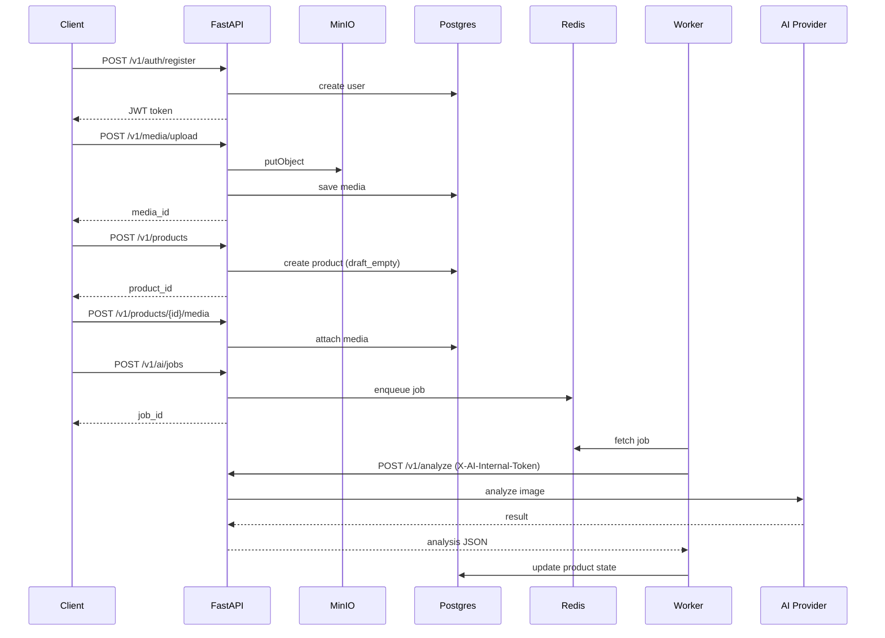

# Backend Media → Product → AI Pipeline (v2)
**Date:** 2026-01-30  
**Scope:** Clothing API / Worker pipeline

---

## 1. Goal
Stabilize and validate the end-to-end backend pipeline:
Auth → Media upload → Product draft → Media attach → AI Job → Worker → Analyze.

---

## 2. High-level Architecture

```
Client
  |
  |  HTTP (Bearer JWT)
  v
API (FastAPI)
  |-- /v1/auth/*
  |-- /v1/media/upload  ---> MinIO (products bucket)
  |-- /v1/products      ---> Postgres
  |-- /v1/ai/jobs       ---> Redis (queue)
  |
  v
Worker (Python)
  |
  |-- reads Redis queue
  |-- calls /v1/analyze (internal)
  |
  v
AI Provider (stub / OpenAI / Gateway)
```

---

## 3. Sequence Diagram (Mermaid)



---

## 4. State Model

```
draft_empty
   |
   | + media attached
   v
editable
   |
   | AI completed
   v
ready_to_publish
   |
   | publish
   v
published
```

States are **authoritative on backend**. UI derives CTA from state, not vice versa.

---

## 5. Security Model

### External
- Bearer JWT (`Authorization: Bearer <token>`)
- Used for all `/v1/*` public endpoints

### Internal
- `X-AI-Internal-Token`
- Required for `/v1/analyze`
- Shared secret via env:
  - `AI_INTERNAL_TOKEN`
  - `AI_INTERNAL_URL`

---

## 6. Key Files Created / Used

### API
- `apps/api/main.py` — entrypoint, router wiring
- `apps/api/media_routes.py` — upload & fetch media
- `apps/api/routes/products.py` — product lifecycle
- `apps/api/routes/ai_jobs.py` — enqueue AI jobs
- `apps/api/routes/ai_internal.py` — internal analyze endpoint

### Worker
- `apps/api/worker.py` — Redis consumer, job executor

### Contracts / State
- `apps/api/contracts/state.py`
- `apps/api/contracts/state_ui_map.py`

---

## 7. Principles Fixed Today

1. **Backend is source of truth** (no UI-driven state)
2. **Media first, product later**
3. **AI via async job only**
4. **Strict separation: public vs internal API**
5. **Idempotent job handling**
6. **Docker-first execution**

---

## 8. Known Issues / Follow-ups

- Validate real image size > 0 bytes
- Add retries & DLQ for failed AI jobs
- Persist AI result schema
- Add product state transition guards

---

## 9. Next Steps

- Connect real AI provider
- UI polling for `/v1/ai/jobs/{id}`
- Auto-transition product to `ready_to_publish`
- Metrics & tracing

---

**Status:** Pipeline functional end-to-end.
