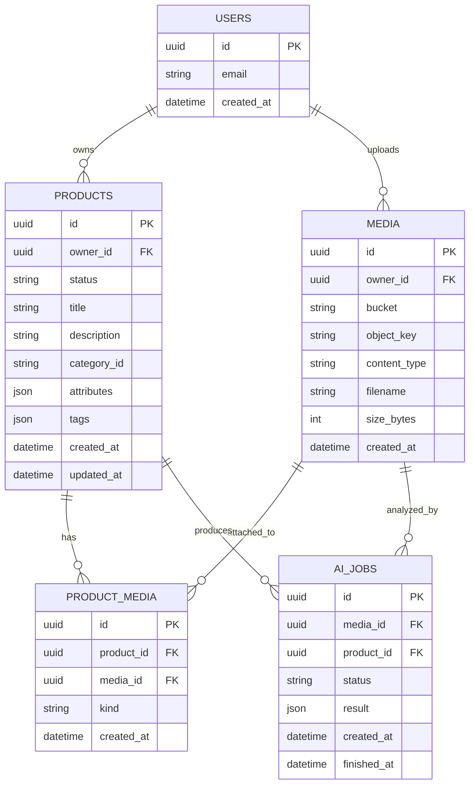

# Backend AI Product Pipeline — v3

## Executive Summary
(см. блок ниже)

## Executive Summary — Backend AI Product Pipeline

Цель  
Построен масштабируемый backend-пайплайн для AI-генерации товарных карточек по изображениям с чётким разделением ответственности, безопасной моделью доступа и поддержкой асинхронной обработки.

Что реализовано

1. Единый lifecycle продукта  
- Draft → Editable → AI Processing → Ready → Published  
- Состояние продукта — Single Source of Truth  
- UI управляется backend-логикой (state → ui flags)

2. Асинхронная AI-архитектура  
- AI не блокирует API  
- Все анализы выполняются через очередь и worker  
- Поддержка повторных запусков, ретраев, частичных результатов

3. Безопасность и изоляция  
- JWT для пользовательских запросов  
- Отдельный AI_INTERNAL_TOKEN для worker  
- Пользователь никогда не имеет прямого доступа к AI endpoint

4. Расширяемость  
- Поддержка нескольких AI-провайдеров  
- Возможность добавления новых типов media  
- Возможность AI-извлечения нескольких товаров из одного изображения

---

## Архитектурные принципы

- Event-driven подход (outbox pattern)  
- Backend-driven UI  
- Stateless API + Stateful domain  
- Idempotency & replay safety  
- No AI logic in UI  

---

## ER Diagram (Products / Media / AI Jobs)

---

## Реализованные эндпоинты (ключевые)

- POST /v1/auth/register
- POST /v1/auth/login
- GET  /v1/auth/me

- POST /v1/media/upload
- GET  /v1/media/{id}/content

- POST /v1/products
- GET  /v1/products
- GET  /v1/products/{id}
- PATCH /v1/products/{id}
- POST /v1/products/{id}/media
- POST /v1/products/{id}/publish

- POST /v1/ai/jobs
- GET  /v1/ai/jobs/{id}

- POST /v1/analyze (internal)

---

## Итог

Backend полностью готов как фундамент:
- для UI,
- для AI-экспериментов,
- для масштабирования до маркетплейса.

